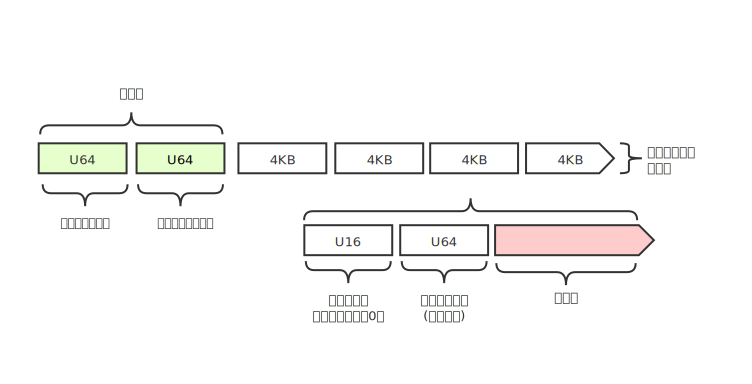
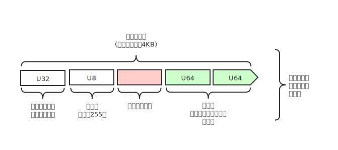
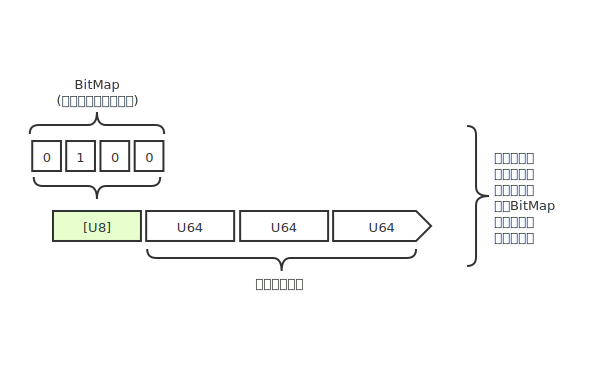

# Physeter

这是一个基于Rust编程语言的对象存储服务器，项目创建的目的是为了解决作者本人管理大量媒体文件的困扰，所以便开始自行创建一个简单的对象存储服务器，用于支持在低功耗设备运行（比如树莓派），并同时提供不错的性能，因为操作系统提供的文件系统对比管理海量文件性能有限，以及难以有效合并分散于多个磁盘的文件，所以这个项目使用集中管理文件内容的方式组织多个文件，以及支持多磁盘和多位置合并，为了提高读写速度，本项目使用多线程同时写入多个文件，将读写负载分散到多个目标文件来获得并行读写速度，而且对于SSD固态存储的写入放大（WAF）等等问题也做了相应优化.  

> 本项目作为流媒体服务器[Spinosa](https://github.com/quasipaa/Spinosa)的附属项目，同样也是为了解决流媒体服务器的静态存储问题，这是一个必要的附属服务.

### 版本
目前还在实现中，无测试版本.

### 计划
* [ ] 完成核心实现  
* [ ] 完成多线程支持  
* [ ] 网络栈接口封装  
* [ ] 创建外围驱动  

### 概述

服务运行多个读写线程，每个线程管理一个分区文件，分区文件内部使用固定大小分片存储数据，分区头包含了两个索引信息，第一个为文件列表的链表头部索引，第二个为失效等待重新覆盖的分片索引列表头部索引，因为需要考虑多种不依赖分配表的读取，所以分片内部保留了链表索引，每个分片指向下个分片的位置，如果为`0`则表示没有后续分片.

分区初始化时根据分区头的索引读取inode信息，inode内部存储了文件名和分批表，inode列表以链表方式存放，释放管理和分片的释放采用同样的方式管理.

分区第二项为动态失效表，以分片链表形式存放，每个分片内部维护一个BitMap标记当前分片哪些索引已经覆盖，创建这个分片内部分配表的目的为了可以只处理部分索引，等到当前分片全部失效时则将整个分片释放，释放管理和分片的释放采用同样的方式管理.

### License
[GPL](./LICENSE)
Copyright (c) 2020 Mr.Panda.